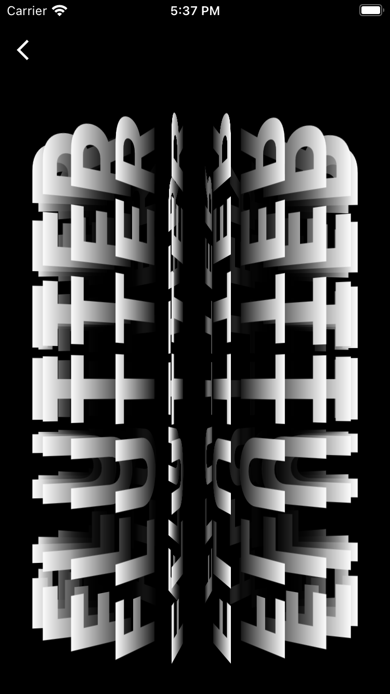

# flutter_3d_sipner_text

A new Flutter project.

## Getting Started

# ScreenShot1 

# ScreenShot2 

# ScreenShot13

# ScreenShot4

# Result

# Tutorial
https://www.youtube.com/watch?v=cJFWEZ3FVpo&t=2565s

# Blog 
https://fidev.io/kinetic-poster/

This project is a starting point for a Flutter application.

A few resources to get you started if this is your first Flutter project:

- [Lab: Write your first Flutter app](https://docs.flutter.dev/get-started/codelab)
- [Cookbook: Useful Flutter samples](https://docs.flutter.dev/cookbook)

For help getting started with Flutter development, view the
[online documentation](https://docs.flutter.dev/), which offers tutorials,
samples, guidance on mobile development, and a full API reference.
